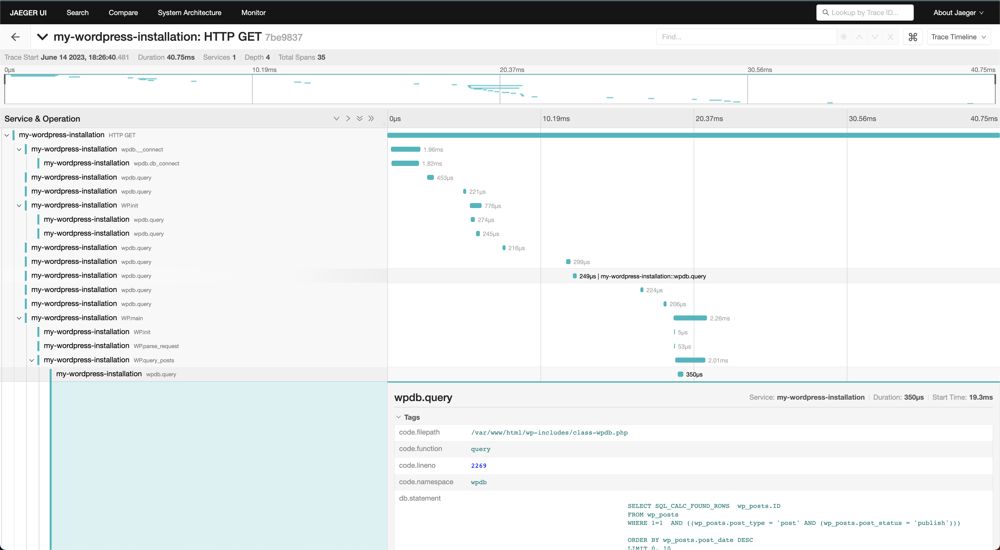

# OpenTelemetry Wordpress Instrumentation example

This example auto instruments the official [Wordpress docker image](https://hub.docker.com/_/wordpress) with OpenTelemetry. The
official image is extended in
[`autoinstrumented-wordpress.dockerfile`](./autoinstrumented-wordpress.dockerfile) to

1. Install [OTel Wordpress instrumentation](../../../src/Instrumentation/Wordpress/) and
dependencies with composer in a build stage
1. Install [OTel PHP
extension](https://github.com/open-telemetry/opentelemetry-php-instrumentation) in the official
Wordpress image and configure it into the image's PHP installation (see
[`otel.php.ini`](./otel.php.ini)). This extension is required by the Wordpress instrumentation.
1. Copy the composer installed deps into the image. [`otel.php.ini`](./otel.php.ini) has a
`auto_prepend_file=/var/www/otel/autoload.php` clause so that OTel is loaded into Wordpress
sources at runtime.

The example has Wordpress send OTLP -> [OpenTelemetry
Collector](https://opentelemetry.io/docs/collector/) -> Jaeger all in one agent. You can
alternatively configure the OpenTelemetry Collector to send telemetry to many different
backends, or send from PHP directly to Jaeger.

## Running it

In a shell, run:

```sh
docker-compose up --build --abort-on-container-exit
```

Then, go to http://localhost:8080 to set up Wordpress. Click around the finished site and you
should see traces in Jaeger at http://localhost:16686

## Example trace

Here's an example of how a trace might look in Jaeger:


